

	
✨Tech Stack ✨
	

	  
	  
	
	

	
	
	
	
	

 

# 프로젝트 

TripStation은 여행 동행을 찾는 사람들을 위한 웹사이트입니다. 사용자는 원하는 여행지와 일정을 입력하면, 같은 여행지를 방문하는 다른 여행자들을 찾아볼 수 있습니다.

## 주요기능

TripStation은 사용자가 여행을 계획하고 동행을 찾을 수 있는 다양한 기능을 제공합니다:

1. **플랜 작성**: 사용자는 자신만의 여행 플랜을 작성할 수 있습니다. 또한, 다른 사용자가 작성한 플랜을 참조하여 새로운 플랜을 작성할 수도 있습니다.
2. **숙소 및 여행 장소 등록**: 사용자는 숙소와 여행 명소를 직접 등록할 수 있습니다.
3. **크루 기능**: 사용자는 크루를 만들거나 기존 크루에 가입할 수 있습니다. 크루의 회원들은 동행 모집 기능을 통해 같이 여행을 갈 수 있습니다.
4. **맞춤 여행**: 사용자는 자신이 작성한 플랜을 기반으로 동행을 모집하고, 같이 여행을 갈 수 있습니다.
5. **패키지 여행**: 가이드가 작성한 플란에 신청을 하면, 패키지 여행에 참여할 수 있습니다.

## ERD
URL : [https://www.erdcloud.com/d/9qrBEmjMs3Q7WXasL](https://www.erdcloud.com/d/XsYr9wajSLxhNGvEZ)
 
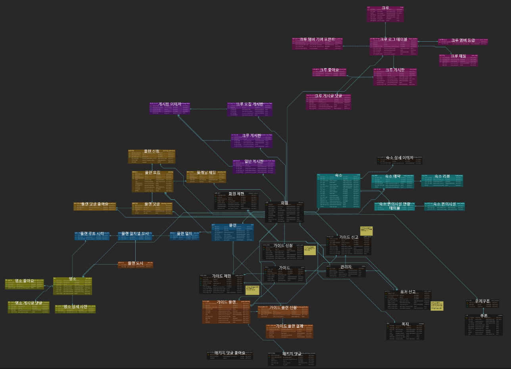

## 주요기능

TripStation은 사용자가 여행을 계획하고 동행을 찾을 수 있는 다양한 기능을 제공합니다:

**로그인 페이지**: 
   - 사용자 로그인 기능과 카카오 로그인 기능을 구현했습니다.
   - 로그인 후 사용자의 개인 정보와 맞춤형 여행 플랜을 제공하도록 설정했습니다.
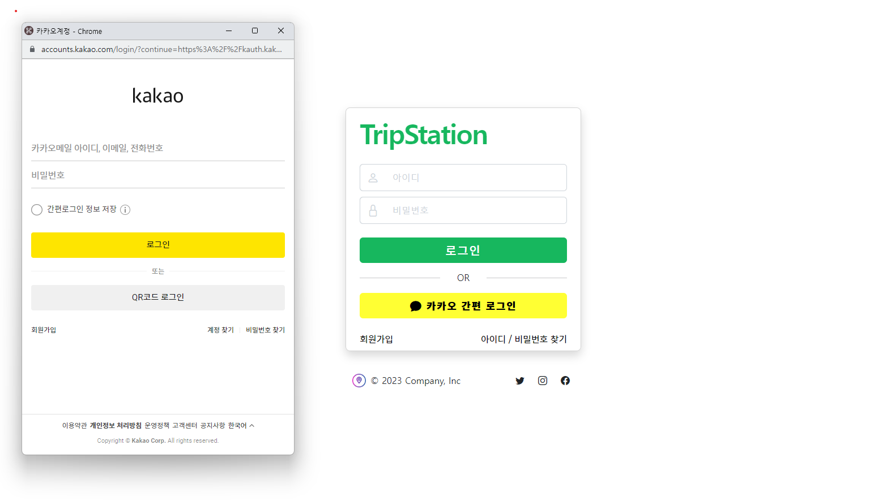

### 플래너 페이지

1. **플랜 메인 페이지**
   - 사용자는 자신만의 여행 플랜을 작성할 수 있습니다. 
   - 제목, 제목 + 내용에 맞춰 플랜을 검색할 수 있습니다.
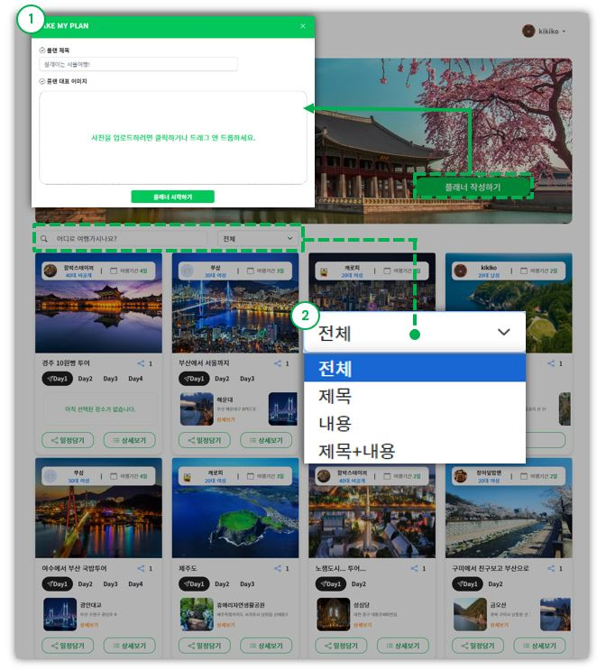

2. **플래너 작성**: 
   - 다른 사용자가 작성한 플랜을 참조하여 새로운 플랜을 작성할 수도 있습니다.
   - 다음 우편번호 API를 이용해 주소 검색 기능을 추가했습니다.
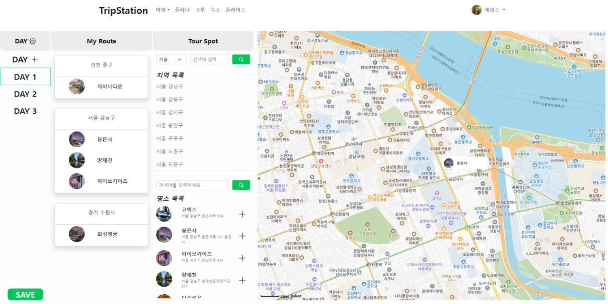

3. **플랜 상세보기**
	- 플랜을 관리, 모집, 또는 일정을 담을 수 있습니다.
	- 일정 별 명소 목록 및 명소 동선을 카카오 맵 api를 통해 구현했습니다.
	- 작성된 플랜을 수정 및 삭제, 동행 모집을 시작할 수 있습니다.
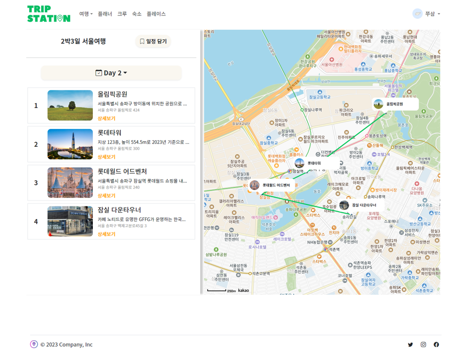

### 동행 모집 페이지

1. **메인 페이지**
   - 동행 모집 리스트를 무한 스크롤로 보여주는 기능과 검색 기능을 구현했습니다.
   - 사용자가 손쉽게 원하는 여행 동행을 찾을 수 있도록 다양한 기준의 검색 기준을 제공합니다.
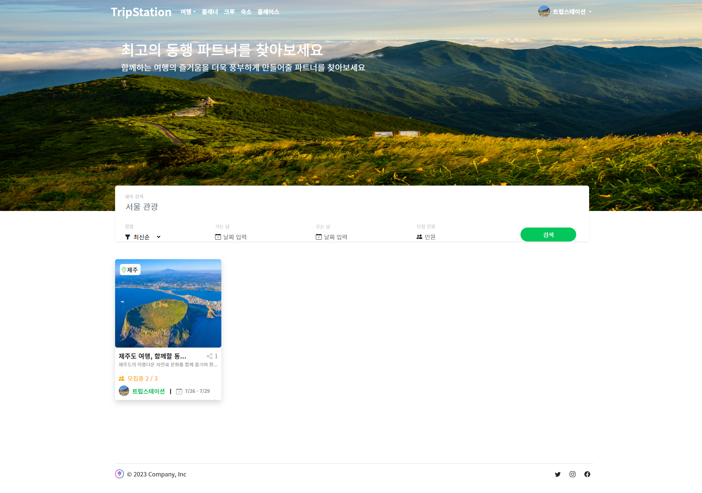
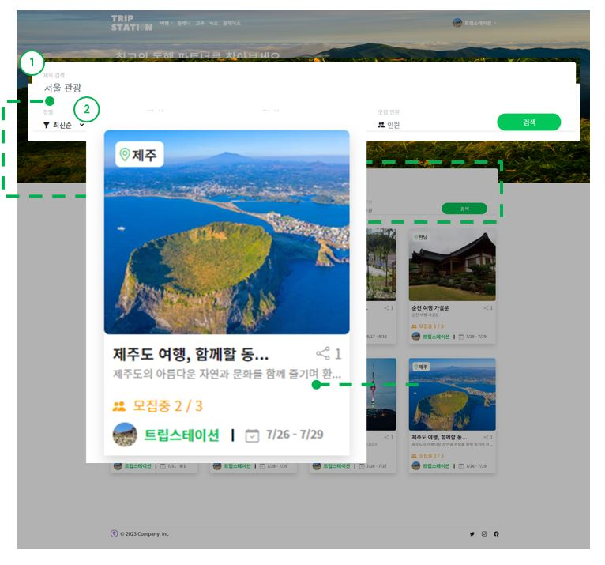

2. **동행 모집 상세 페이지**
	- 일차별 썸네일 이미지를 표시하여 여행의 미리보기 기능을 제공했습니다.
	- 모집 제목, 내용, 인원, 위치, 날짜 등의 세부 내용을 표시합니다.
	- 사용자는 해당 동행 모집글에 신청 및 채팅을 할 수 있습니다.
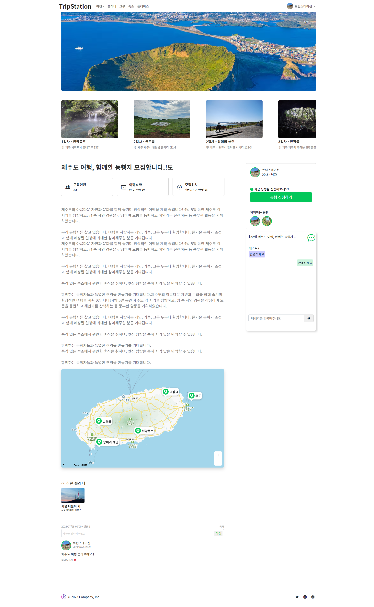

### 크루 페이지

1. **크루 리스트 페이지**
	- 사용자의 크루 가입 정보를 확인할 수 있습니다.
	- 다양한 크루를 찾아보고, 가입하거나 생성할 수 있습니다.
	- 크루에 대한 알림을 실시간으로 받을 수 있습니다.
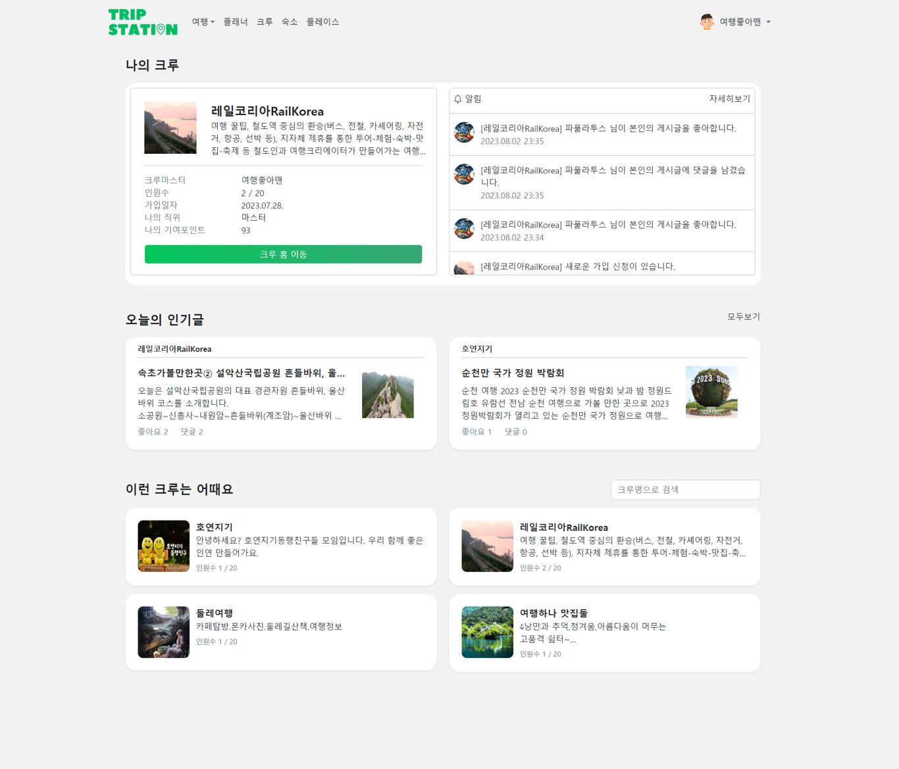

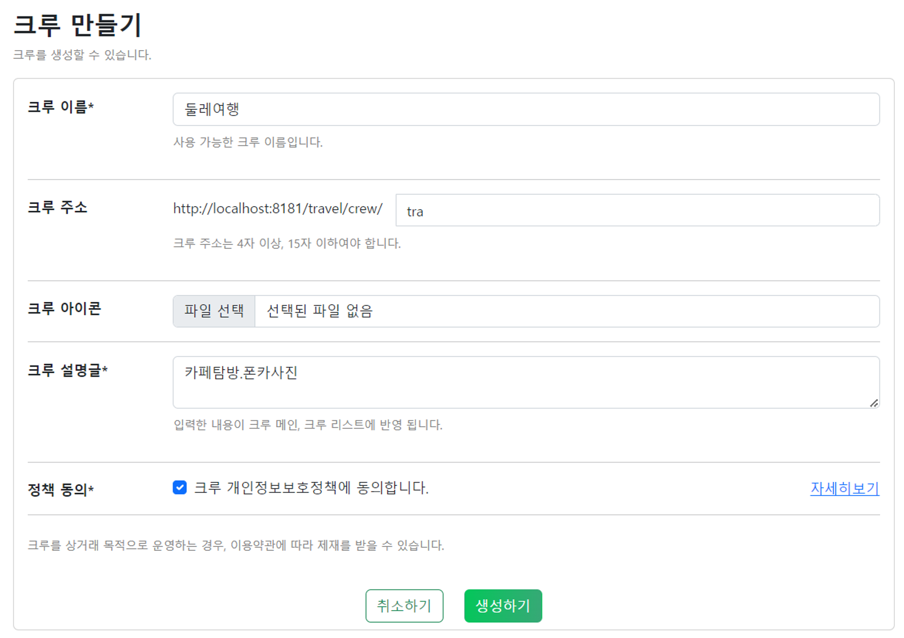

2. **크루 홈페이지**
	- 크루의 회원들은 서로 채팅할 수 있습니다.
	- 검색을 통해 작성된 게시글 내 키워드로 검색할 수 있습니다.
	- 전체공개 및 크루공개로 게시글을 작성할 수 있습니다.
	- 프로필을 클릭하여 해당 유저의 작성된 글을 열람하거나, 쪽지를 보낼 수 있습니다.
	- 작성된 게시글에 좋아요를 누르거나, 댓글을 작성할 수 있습니다.
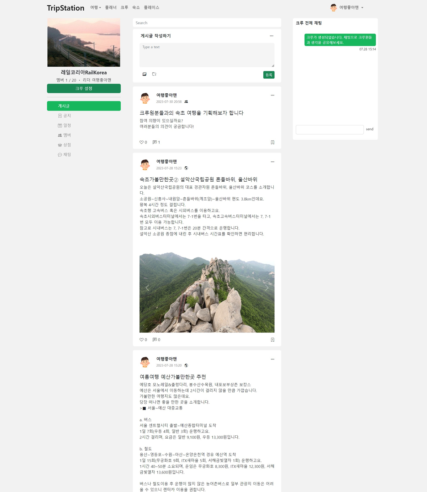
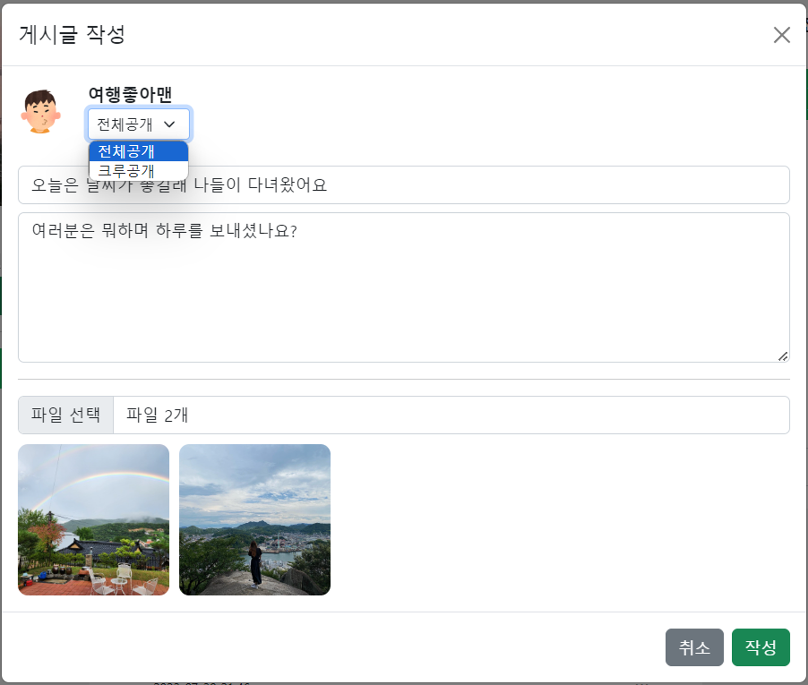
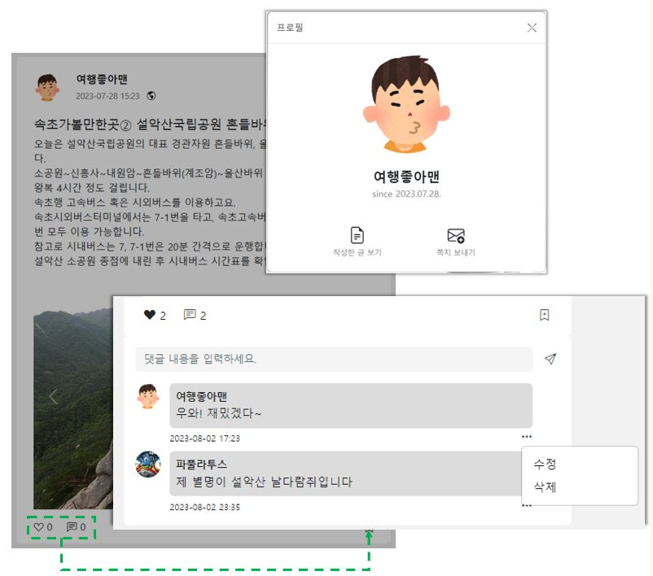

